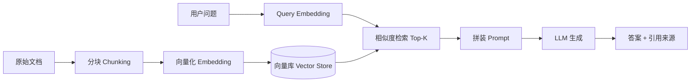

::: tip 保鲜说明（2026-08）
RAG 栈迭代极快。本文示例对齐 **Spring AI 1.0.x**（`ChatModel` / `EmbeddingModel` / `VectorStore`）与 **LangChain4j 1.0.x** 主流 API；具体类名以你项目 BOM 版本为准。向量库选型（pgvector、Milvus、Redis Stack）在 2026 年均已生产可用，按运维能力选型即可。
:::

## 1. 为什么需要 RAG？

纯 LLM 的局限：

- **知识截止**：训练数据之外的事实回答不了或胡编。
- **私有数据**：企业内部文档、工单、产品手册无法塞进 prompt。
- **幻觉**：没有依据时仍"自信"生成错误内容。
- **成本**：把整个知识库塞进 context 不现实。

**RAG（Retrieval-Augmented Generation）**：先**检索**相关文档片段，再把这些片段作为上下文交给 LLM **生成**答案——让回答"有据可查"。

---

## 2. RAG 流水线总览



| 阶段 | 目标 |
|------|------|
| Chunk | 把长文档切成可检索的小段 |
| Embed | 文本 → 稠密向量 |
| Retrieve | 按语义相似度找 Top-K 片段 |
| Generate | LLM 基于片段回答，并尽量引用来源 |

---

## 3. 分块（Chunking）策略

```java
// Spring AI TextSplitter 思路（伪代码组合）
TextSplitter splitter = new TokenTextSplitter(
    512,    // defaultChunkSize：每块约 512 token
    50,     // minChunkSizeChars
    50,     // minChunkLengthToEmbed
    10000,  // maxNumChunks
    true    // keepSeparator
);
List<Document> chunks = splitter.apply(List.of(
    new Document(pdfText, Map.of("source", "handbook-v3.pdf", "page", "12"))
));
```

**实践建议**：

| 策略 | 适用 |
|------|------|
| 固定 token 数（256~1024） | 通用技术文档 |
| 按标题/段落 | Markdown、结构化 Wiki |
| 滑动窗口 + overlap（10%~20%） | 避免语义被截断 |
| 父子块（小块检索、大块给 LLM） | 长法条、合同 |

**元数据**：每块带上 `source`、`page`、`updated_at`，便于引用与过滤过期内容。

---

## 4. Spring AI 完整示例

### 4.1 依赖（OpenAI + pgvector 示意）

```xml
<dependencyManagement>
    <dependencies>
        <dependency>
            <groupId>org.springframework.ai</groupId>
            <artifactId>spring-ai-bom</artifactId>
            <version>1.0.0</version>
            <type>pom</type>
            <scope>import</scope>
        </dependency>
    </dependencies>
</dependencyManagement>

<dependencies>
    <dependency>
        <groupId>org.springframework.ai</groupId>
        <artifactId>spring-ai-starter-model-openai</artifactId>
    </dependency>
    <dependency>
        <groupId>org.springframework.ai</groupId>
        <artifactId>spring-ai-starter-vector-store-pgvector</artifactId>
    </dependency>
</dependencies>
```

```yaml
spring:
  ai:
    openai:
      api-key: ${OPENAI_API_KEY}
      embedding:
        options:
          model: text-embedding-3-small
      chat:
        options:
          model: gpt-4o-mini
    vectorstore:
      pgvector:
        index-type: HNSW
        distance-type: COSINE_DISTANCE
```

### 4.2 入库：Embed + VectorStore

```java
@Service
@RequiredArgsConstructor
public class KnowledgeIngestService {

    private final EmbeddingModel embeddingModel;
    private final VectorStore vectorStore;

    public void ingest(String content, Map<String, Object> metadata) {
        List<Document> chunks = split(content, metadata);
        vectorStore.add(chunks); // 内部调用 EmbeddingModel 并写入向量库
    }

    private List<Document> split(String text, Map<String, Object> meta) {
        TokenTextSplitter splitter = new TokenTextSplitter();
        return splitter.apply(List.of(new Document(text, meta)));
    }
}
```

### 4.3 检索 + 生成

```java
@Service
@RequiredArgsConstructor
public class RagChatService {

    private final ChatModel chatModel;
    private final VectorStore vectorStore;

    public RagResponse ask(String question) {
        // 1. 检索
        List<Document> hits = vectorStore.similaritySearch(
                SearchRequest.builder()
                        .query(question)
                        .topK(5)
                        .similarityThreshold(0.75)
                        .build()
        );

        // 2. 拼装上下文
        String context = hits.stream()
                .map(doc -> "[来源: %s]\n%s".formatted(
                        doc.getMetadata().getOrDefault("source", "unknown"),
                        doc.getText()))
                .collect(Collectors.joining("\n\n---\n\n"));

        String system = """
                你是企业知识库助手。仅根据下列「参考资料」回答问题。
                若资料不足以回答，请明确说「根据现有资料无法确定」，不要编造。
                回答末尾列出引用的来源文件名。
                """;

        String user = "参考资料：\n" + context + "\n\n问题：" + question;

        // 3. 生成（Spring AI 1.0 ChatModel API）
        ChatResponse response = chatModel.call(new Prompt(List.of(
                new SystemMessage(system),
                new UserMessage(user)
        )));

        String answer = response.getResult().getOutput().getText();
        List<String> sources = hits.stream()
                .map(d -> String.valueOf(d.getMetadata().get("source")))
                .distinct()
                .toList();

        return new RagResponse(answer, sources);
    }
}

public record RagResponse(String answer, List<String> sources) {}
```

---

## 5. LangChain4j 对照示例

```xml
<dependency>
    <groupId>dev.langchain4j</groupId>
    <artifactId>langchain4j-spring-boot-starter</artifactId>
    <version>1.0.0-beta3</version>
</dependency>
<dependency>
    <groupId>dev.langchain4j</groupId>
    <artifactId>langchain4j-open-ai-spring-boot-starter</artifactId>
    <version>1.0.0-beta3</version>
</dependency>
```

```java
@Service
@RequiredArgsConstructor
public class LangChain4jRagService {

    private final EmbeddingModel embeddingModel;
    private final ChatModel chatModel;
    private final EmbeddingStore<TextSegment> embeddingStore;

  public String ask(String question) {
    Embedding queryEmbedding = embeddingModel.embed(question).content();
    List<EmbeddingMatch<TextSegment>> matches = embeddingStore.findRelevant(
        queryEmbedding, 5, 0.75);

    String context = matches.stream()
        .map(m -> m.embedded().text())
        .collect(Collectors.joining("\n\n"));

    return chatModel.chat("""
        根据以下资料回答问题，不知道就说不知道。

        资料：
        %s

        问题：%s
        """.formatted(context, question));
  }
}
```

LangChain4j 的 `AiServices` 可进一步用接口 + 注解封装 RAG，适合快速原型。

---

## 6. 向量库选型（2026）

| 产品 | 特点 | 适用 |
|------|------|------|
| **pgvector** | PostgreSQL 扩展，事务一致 | 已有 PG、中小规模 |
| **Milvus / Zilliz** | 专用向量库、十亿级 | 大规模、独立扩展 |
| **Redis Stack** | 低延迟、已有 Redis 运维 | 实时、小规模语义缓存 |
| **Elasticsearch** | 混合全文 + 向量 | 已有 ES 搜索栈 |
| **Chroma / Qdrant** | 轻量、易部署 | 原型、边缘场景 |
| **云托管** | OpenSearch Serverless、阿里云向量检索 | 免运维 |

**维度**：embedding 模型输出维度（如 `text-embedding-3-small` 为 1536）必须与表结构一致。

---

## 7. 检索增强技巧

### 7.1 混合检索（Hybrid）

纯向量对**精确关键词**（型号、错误码）弱，结合 BM25：

```
最终分数 = α * 向量相似度 + (1-α) * 关键词分数
```

Spring AI / ES 8+ 均支持 hybrid query。

### 7.2 查询改写

用户口语化问题 → LLM 改写为检索友好 query，或多 query 扩展后合并结果。

### 7.3 重排序（Rerank）

先向量召回 Top-50，再用 Cross-Encoder Rerank 模型取 Top-5，显著提升精度（增加延迟与成本）。

### 7.4 元数据过滤

```java
vectorStore.similaritySearch(SearchRequest.builder()
    .query(question)
    .topK(5)
    .filterExpression("department == 'HR' && year >= 2025")
    .build());
```

---

## 8. 评估（Evaluation）

没有评估的 RAG 等于盲飞。至少跟踪：

| 指标 | 含义 |
|------|------|
| **Recall@K** | 正确文档是否出现在 Top-K |
| **Faithfulness** | 答案是否可由检索片段推出 |
| **Answer Relevance** | 答案是否切题 |
| **Latency P95** | 检索 + 生成延迟 |

```java
// 简易黄金集：question + expectedSourceDoc
record GoldCase(String question, String expectedDocId) {}

void evaluate(List<GoldCase> cases) {
    int hit = 0;
    for (GoldCase c : cases) {
        var hits = vectorStore.similaritySearch(c.question(), 5);
        boolean found = hits.stream()
            .anyMatch(d -> c.expectedDocId().equals(d.getMetadata().get("doc_id")));
        if (found) hit++;
    }
    log.info("Recall@5 = {}", (double) hit / cases.size());
}
```

生产可接入 **Ragas**、**LangSmith** 或自建标注平台，在发版前回归黄金集。

---

## 9. 常见陷阱

| 陷阱 | 表现 | 对策 |
|------|------|------|
| **幻觉** | 无资料仍编造 | 系统 prompt 强制"不知道就说不知道"；降低 temperature |
| **陈旧文档** | 答过期政策 | 元数据 `updated_at` + 过滤；定期重索引 |
| **chunk 过大/过小** | 检索噪声或上下文不足 | A/B 调 chunk size 与 overlap |
| **忽略权限** | 检索到无权限文档 | 检索前按 `user_id`/角色 filter |
| **重复入库** | 相似块刷屏 Top-K | 去重、MMR 多样性检索 |
| **只评生成不评检索** | 换模型无效 | 先修 Recall，再调 prompt |
| **中文分词** | 关键词检索差 | 混合检索 + 中文 embedding 模型 |

---

## 10. 生产架构示意

```
                    ┌─────────────┐
  文档上传 ────────►│ Ingest 服务  │──► 向量库
  (S3/OSS)          │ 定时全量/增量 │
                    └─────────────┘
                           ▲
  用户提问 ──► API Gateway ──► RAG 服务 ──► LLM
                    │              │
                    │              └──► 返回答案 + citations
                    └── 鉴权、限流、审计日志
```

- **增量同步**：Wiki/Webhook 触发单篇重索引。
- **缓存**：相同问题短 TTL 语义缓存（注意权限）。
- **可观测**：记录 retrieval ids、token 用量、用户反馈（👍/👎）闭环。

---

## 11. 何时不用 RAG？

- 知识量极小、可全部放入 system prompt。
- 需要复杂多步推理且工具链更适合 **Agent + Function Calling**。
- 强实时数据（股价）应查 API 而非静态向量库。
- 法规场景要求 100% 可审计时，RAG 需配合规则引擎与人工审核。

---

## 参考

- [Spring AI Reference — RAG](https://docs.spring.io/spring-ai/reference/api/retrieval-augmented-generation.html)
- [LangChain4j Documentation](https://docs.langchain4j.dev/)
- [OpenAI Embeddings Guide](https://platform.openai.com/docs/guides/embeddings)
