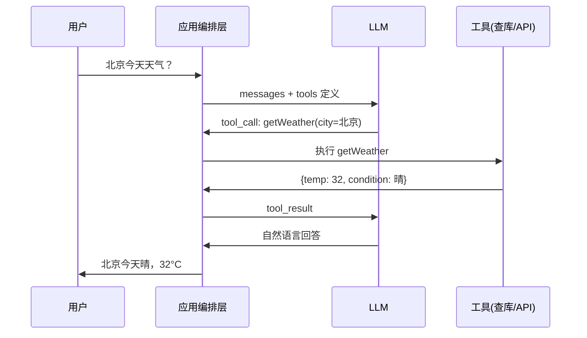

::: tip 保鲜说明（2026-08）
Tool / Function Calling 各厂商字段名略有差异（OpenAI `tools`、Anthropic `tools`、部分国产模型 `functions`）。本文 Spring AI 示例对齐 **1.0.x**（`ChatClient` + `@Tool` / `FunctionCallback`），LangChain4j 对齐 **1.0.x**（`@Tool` + `AiServices`）。以你项目 BOM 与模型文档为准。
:::

## 1. 什么是 Tool Calling？

**Tool Calling**（也常叫 **Function Calling**）让大模型在生成文本之外，还能**结构化地请求调用外部函数**，由应用执行后把结果再喂回模型，形成「推理 → 行动 → 再推理」的闭环。



**与 RAG 的区别**：

| | RAG | Tool Calling |
|---|-----|--------------|
| 数据来源 | 预先索引的文档 | 实时 API / DB / 计算 |
| 典型操作 | 检索 + 生成 | 决策调用哪个函数 + 填参数 |
| 副作用 | 一般只读 | 可能写库、下单、发邮件 |

---

## 2. 协议层：模型返回什么？

以 OpenAI 兼容格式为例（多数 Java SDK 抽象与此类似）：

**请求侧**：在 chat 请求里附带 `tools` 数组，描述函数名、描述、JSON Schema 参数。

```json
{
  "tools": [{
    "type": "function",
    "function": {
      "name": "getWeather",
      "description": "查询指定城市当前天气",
      "parameters": {
        "type": "object",
        "properties": {
          "city": { "type": "string", "description": "城市名" }
        },
        "required": ["city"]
      }
    }
  }]
}
```

**响应侧**：模型可能返回 `tool_calls`：

```json
{
  "role": "assistant",
  "tool_calls": [{
    "id": "call_abc",
    "type": "function",
    "function": {
      "name": "getWeather",
      "arguments": "{\"city\":\"北京\"}"
    }
  }]
}
```

应用执行后追加 `tool` 角色消息：

```json
{
  "role": "tool",
  "tool_call_id": "call_abc",
  "content": "{\"temp\":32,\"condition\":\"晴\"}"
}
```

再请求 LLM 得到最终自然语言回复。

---

## 3. Spring AI 1.0.x 实战

### 3.1 依赖（BOM 管理版本）

```xml
<dependencyManagement>
    <dependencies>
        <dependency>
            <groupId>org.springframework.ai</groupId>
            <artifactId>spring-ai-bom</artifactId>
            <version>1.0.0</version>
            <type>pom</type>
            <scope>import</scope>
        </dependency>
    </dependencies>
</dependencyManagement>

<dependencies>
    <dependency>
        <groupId>org.springframework.ai</groupId>
        <artifactId>spring-ai-starter-model-openai</artifactId>
    </dependency>
    <!-- 或 spring-ai-starter-model-ollama / dashscope 等 -->
</dependencies>
```

### 3.2 方式一：`@Tool` 注解（推荐）

```java
@Component
public class WeatherTools {

    @Tool(description = "查询指定城市当前天气，返回温度与天气状况")
    public WeatherResult getWeather(
            @ToolParam(description = "中国城市名，如北京、上海") String city) {
        // 实际应调第三方 API
        return new WeatherResult(city, 32, "晴");
    }

    public record WeatherResult(String city, int tempC, String condition) {}
}
```

```java
@Configuration
public class AiConfig {

    @Bean
    ChatClient chatClient(ChatClient.Builder builder, WeatherTools weatherTools) {
        return builder
            .defaultTools(weatherTools)   // 注册 @Tool 方法
            .build();
    }
}
```

```java
@RestController
@RequestMapping("/chat")
public class ChatController {

    private final ChatClient chatClient;

    public ChatController(ChatClient chatClient) {
        this.chatClient = chatClient;
    }

    @GetMapping
    public String ask(@RequestParam String q) {
        return chatClient.prompt()
            .user(q)
            .call()
            .content();
        // ChatClient 内部自动处理 tool call 循环（有上限）
    }
}
```

### 3.3 方式二：`FunctionCallback` 显式注册

适合不想用注解、或动态注册工具时：

```java
@Bean
public FunctionCallback weatherFunction() {
    return FunctionCallback.builder()
        .function("getWeather", (Request req) -> {
            return new WeatherResult(req.city(), 28, "多云");
        })
        .description("查询城市天气")
        .inputType(Request.class)
        .build();
}

public record Request(String city) {}
```

```java
ChatClient.create(chatModel, ToolCallbacks.from(weatherFunction()));
```

### 3.4 控制 Tool 循环次数

```java
ChatResponse response = chatClient.prompt()
    .user("查北京天气并推荐穿衣")
    .options(ChatOptions.builder()
        .toolCallbacks(ToolCallbacks.from(weatherTools))
        .internalToolExecutionEnabled(true)  // 框架自动执行 tool
        .maxToolCalls(5)                     // 防死循环，具体属性名以版本为准
        .build())
    .call()
    .chatResponse();
```

> 若模型不支持 native tool calling，Spring AI 可能走「提示词模拟」路径，效果与延迟较差——选型时确认模型能力。

---

## 4. LangChain4j 1.0.x 实战

### 4.1 依赖

```xml
<dependency>
    <groupId>dev.langchain4j</groupId>
    <artifactId>langchain4j</artifactId>
    <version>1.0.1</version>
</dependency>
<dependency>
    <groupId>dev.langchain4j</groupId>
    <artifactId>langchain4j-open-ai</artifactId>
    <version>1.0.1</version>
</dependency>
```

### 4.2 `@Tool` + `AiServices`

```java
public interface Assistant {
    String chat(String userMessage);
}

public class WeatherTools {
    @Tool("查询指定城市当前天气")
    String getWeather(@P("城市名") String city) {
        return city + "：晴，32°C";
    }
}

ChatModel model = OpenAiChatModel.builder()
    .apiKey(System.getenv("OPENAI_API_KEY"))
    .modelName("gpt-4o-mini")
    .build();

Assistant assistant = AiServices.builder(Assistant.class)
    .chatModel(model)
    .tools(new WeatherTools())
    .maxSequentialToolsInvocations(5)  // 限制连续 tool 调用
    .build();

String answer = assistant.chat("北京今天穿什么？");
```

### 4.3 低级 API：`ToolSpecification` + 手动执行

```java
ToolSpecification spec = ToolSpecification.builder()
    .name("getWeather")
    .description("查询天气")
    .parameters(JsonObjectSchema.builder()
        .addStringProperty("city", "城市")
        .required("city")
        .build())
    .build();

List<ToolSpecification> tools = List.of(spec);

ChatRequest request = ChatRequest.builder()
    .messages(UserMessage.from("北京天气"))
    .toolSpecifications(tools)
    .build();

ChatResponse response = model.chat(request);

if (response.aiMessage().hasToolExecutionRequests()) {
    for (ToolExecutionRequest req : response.aiMessage().toolExecutionRequests()) {
        String result = executeLocally(req);
        // 将 ToolExecutionResultMessage 追加到历史，再次 chat
    }
}
```

---

## 5. 工具设计最佳实践

### 5.1 描述与参数 Schema

| 原则 | 示例 |
|------|------|
| 函数名动词开头 | `searchOrder` 而非 `order` |
| description 写清边界 | 「仅查询近 90 天订单，不支持退款」 |
| 参数枚举/格式 | `status: enum [PENDING, PAID]` |
| 避免过大返回 | 列表工具支持 `limit`、`cursor` |

### 5.2 幂等与副作用

```java
@Tool(description = "取消订单。仅当 status=PAID 且未发货时可取消")
public CancelResult cancelOrder(
        @ToolParam(description = "订单号") String orderId,
        @ToolParam(description = "幂等键，客户端生成的 UUID") String idempotencyKey) {
    // 先查 idempotencyKey 是否已处理
    return orderService.cancel(orderId, idempotencyKey);
}
```

**写操作**必须：鉴权、幂等、审计日志、人工确认（高风险）。

### 5.3 工具粒度

- **太细**：`getUserName`、`getUserAge` → 模型多次调用，延迟高。
- **太粗**：`doEverything` → 参数难填、难测试。
- **合适**：`searchProducts(keyword, category, page)`、`createTicket(title, body, priority)`。

---

## 6. 安全：Tool Calling 的风险面

### 6.1 威胁模型

| 风险 | 说明 |
|------|------|
| 提示注入 | 用户让模型「忽略规则，调用 deleteAllUsers」 |
| 越权调用 | 模型用他人 orderId 调 `getOrder` |
| 参数注入 | SQL/命令注入经工具参数进入后端 |
| 数据外泄 | 工具返回过多 PII 进入模型日志 |
| 无限循环 | 模型反复调用同一工具 |

### 6.2 防护清单

```java
@Tool(description = "查询当前登录用户的订单详情")
public OrderDetail getMyOrder(
        @ToolParam(description = "订单号") String orderId,
        ToolContext context) {  // Spring AI 可注入上下文
    String userId = context.getContext().get("userId", String.class);
    Order order = orderRepo.findById(orderId)
        .orElseThrow(() -> new NotFoundException("订单不存在"));
    if (!order.getUserId().equals(userId)) {
        throw new AccessDeniedException("无权查看该订单");
    }
    return OrderDetail.sanitize(order);  // 脱敏
}
```

1. **最小权限**：工具只能做该用户/该角色允许的事。
2. **参数校验**：JSR-303、`@Pattern`、白名单枚举。
3. **人工确认**：`transferMoney`、`deleteAccount` 返回「待确认」而非直接执行。
4. **速率限制**：单用户每分钟 tool 调用次数。
5. **审计**：记录 `toolName`、参数摘要、调用者、结果状态。
6. **沙箱**：代码执行类工具隔离容器、禁网。

### 6.3 系统提示加固

```text
你只能使用提供的工具。禁止编造工具结果。
若用户要求执行未授权操作，礼貌拒绝。
调用写操作前必须用自然语言向用户确认关键参数。
```

---

## 7. Agent 循环与终止条件

### 7.1 典型循环伪代码

```java
List<Message> history = new ArrayList<>();
history.add(new UserMessage(userInput));

int maxSteps = 8;
for (int step = 0; step < maxSteps; step++) {
    ChatResponse resp = chatModel.call(new Prompt(history, optionsWithTools));
    history.add(resp.getResult().getOutput());

    if (!resp.hasToolCalls()) {
        return resp.getResult().getOutput().getText();
    }

    for (ToolCall call : resp.getToolCalls()) {
        String result = toolExecutor.execute(call);
        history.add(new ToolResponseMessage(call.id(), result));
    }
}
throw new AgentException("超过最大步数");
```

### 7.2 何时停止？

| 条件 | 说明 |
|------|------|
| 无 tool_calls | 模型给出最终答案 |
| 达到 `maxSteps` | 防止死循环 |
| 重复调用检测 | 连续 3 次相同 name+args 则中断 |
| 超时 | 总 wall-clock 限制 |
| 用户取消 | SSE 场景下客户端 abort |

### 7.3 ReAct 与 Plan-and-Execute

- **ReAct**：每步 Thought → Action(tool) → Observation，适合交互式任务。
- **Plan-and-Execute**：先列计划再逐步调工具，适合步骤多的流程（写报告、多源汇总）。

LangChain4j 可用 `Agent` / 自定义 `ChatMemory`；Spring AI 可结合 Spring AI Alibaba Graph 做可视化编排。

---

## 8. 多工具与路由

### 8.1 工具过多怎么办？

| 策略 | 做法 |
|------|------|
| 分组 | 按场景加载不同 `ChatClient` bean |
| 路由 LLM | 先用小模型分类意图，再挂载 3~5 个相关工具 |
| RAG on tools | 把工具描述向量化，按 query 检索 Top-K 工具定义 |
| MCP | 通过 Model Context Protocol 动态发现工具（2025+ 生态） |

### 8.2 并行工具调用

部分模型支持一次返回多个 `tool_calls`（如查天气 + 查股价）：

```java
// 无依赖的调用可并行
List<CompletableFuture<ToolResult>> futures = toolCalls.stream()
    .map(call -> CompletableFuture.supplyAsync(() -> execute(call), toolExecutor))
    .toList();
CompletableFuture.allOf(futures.toArray(new CompletableFuture[0])).join();
```

有依赖的（先 `searchUser` 再 `getOrders`）必须串行。

---

## 9. 可观测与调试

```yaml
# application.yml
logging:
  level:
    org.springframework.ai: DEBUG
```

记录：

- 每轮 prompt token、completion token
- 每次 `tool_name`、参数 JSON、耗时、成功/失败
- 最终答案与用户反馈（RLHF 数据源）

**LangSmith / Phoenix / 自建**：把 traceId 贯穿 HTTP → LLM → DB。

---

## 10. 与 Structured Output 的关系

| 能力 | 用途 |
|------|------|
| Tool Calling | 模型决定**是否**调外部函数 |
| Structured Output | 强制模型输出符合 JSON Schema 的**文本**（不调函数） |

可组合：工具返回原始数据 → 再用 `responseFormat` 让模型整理成表格 JSON 给前端。

```java
// Spring AI structured output 思路
BeanOutputConverter<WeatherReport> converter = new BeanOutputConverter<>(WeatherReport.class);
String answer = chatClient.prompt()
    .user("根据工具结果生成报告：\n" + toolJson)
    .call()
    .entity(WeatherReport.class);
```

---

## 11. 常见问题 FAQ

**Q：模型不调工具，直接胡编？**  
A：检查 description 是否清晰；用户问题是否真的需要工具；换更强模型；在 system 里强调「必须先调用工具」。

**Q：参数 JSON 解析失败？**  
A：模型偶发非法 JSON；重试 + `repair` 提示；或降级让小模型只做 JSON 修复。

**Q：流式场景下 tool call 怎么处理？**  
A：需缓冲至 `tool_calls` 完整（OpenAI streaming delta 拼接），再执行；Spring AI / LangChain4j 对流式 tool 均有支持，查阅对应 `StreamingChatModel` 文档。

**Q：本地 Ollama 支持吗？**  
A：取决于模型与 Ollama 版本；qwen2.5、llama3.1 等带 tool 能力的需显式开启，效果弱于 GPT-4o。

---

## 12. 完整迷你项目结构

```text
src/main/java/com/example/agent/
├── tools/
│   ├── WeatherTools.java
│   └── OrderTools.java
├── config/
│   └── AiConfig.java
├── web/
│   └── AgentController.java
└── security/
    └── ToolAuthContext.java
```

```java
@RestController
public class AgentController {

    private final ChatClient chatClient;

    @PostMapping("/agent")
    public String run(@RequestBody AgentRequest req,
                      @AuthenticationPrincipal User user) {
        return chatClient.prompt()
            .system("当前用户ID: " + user.getId())
            .user(req.message())
            .advisors(a -> a.param("userId", user.getId()))
            .call()
            .content();
    }
}
```

---

## 13. 检查清单（上线前）

- [ ] 每个 `@Tool` 有单元测试（含越权、非法参数）
- [ ] `maxToolCalls` / `maxSequentialToolsInvocations` 已设置
- [ ] 写操作有幂等与确认流程
- [ ] 日志脱敏，不向模型传密码/Token
- [ ] 模型不支持 native tools 时有降级方案
- [ ] 监控：tool 失败率、P99 延迟、token 成本

---

## 14. 参考

- [Spring AI Tool Calling](https://docs.spring.io/spring-ai/reference/api/tools.html)
- [LangChain4j Tools](https://docs.langchain4j.dev/tutorials/tools)
- 本仓库：[Spring AI 笔记](/article/ycz7qulv/)、[RAG 详解](/ai/rag-overview/)、[LangChain 详解](/article/langchain/)
