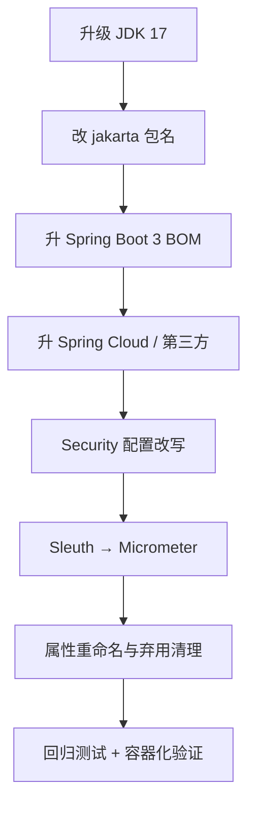

::: tip 保鲜说明（2026-08）
本文面向 **Spring Boot 2.7.x → 3.4.x** 迁移。Boot 3 基线：**Java 17+**、**Jakarta EE 9+**（`jakarta.*` 命名空间）。Spring Cloud 需对齐 2022.0+（2023.x/2024.x 视组件而定）。追踪栈以 **Micrometer Tracing** 替代 Sleuth。
:::

## 1. 为什么要迁？

| Boot 2.7 | Boot 3.x |
|----------|----------|
| Java 8~17 | **最低 Java 17** |
| `javax.*` | **`jakarta.*`** |
| Spring Framework 5 | Spring Framework 6 |
| `spring.factories` 自动配置 | `META-INF/spring/...AutoConfiguration.imports` |
| Spring Cloud Sleuth | **Micrometer Tracing** |
| 部分已弃用 API 移除 | 原生镜像、AOT、虚拟线程友好 |

2.7 已 EOL，安全补丁与新依赖均以 Boot 3 为主。

---

## 2. 迁移总览路线图



**建议**：在 Boot 2.7 上先升到**最新 2.7.x** 并清掉弃用警告，再开 Boot 3 分支。

---

## 3. JDK 17 准备

### 3.1 构建配置

```xml
<properties>
    <java.version>17</java.version>
    <maven.compiler.release>17</maven.compiler.release>
</properties>
```

Gradle：

```kotlin
java {
    toolchain {
        languageVersion.set(JavaLanguageVersion.of(17))
    }
}
```

### 3.2 常见代码调整

| 变更 | 处理 |
|------|------|
| `sun.misc` 内部 API | 换标准 API 或模块开放（尽量避免） |
| SecurityManager 弃用 | 移除依赖 SM 的库 |
| 反射限制 | 升级依赖；GraalVM 需 reachability metadata |

---

## 4. javax → jakarta

### 4.1 包名对照（常用）

| javax | jakarta |
|-------|---------|
| `javax.servlet.*` | `jakarta.servlet.*` |
| `javax.persistence.*` | `jakarta.persistence.*` |
| `javax.validation.*` | `jakarta.validation.*` |
| `javax.annotation.*` | `jakarta.annotation.*` |
| `javax.transaction.*` | `jakarta.transaction.*` |
| `javax.ws.rs.*` | `jakarta.ws.rs.*` |

### 4.2 批量替换

OpenRewrite / IntelliJ 迁移助手：

```xml
<!-- OpenRewrite 示例 -->
<plugin>
    <groupId>org.openrewrite.maven</groupId>
    <artifactId>rewrite-maven-plugin</artifactId>
    <configuration>
        <activeRecipes>
            <recipe>org.openrewrite.java.spring.boot3.UpgradeSpringBoot_3_4</recipe>
        </activeRecipes>
    </configuration>
</plugin>
```

手动注意：

- **不要**替换 `javax.crypto`、`javax.net`、`javax.swing`（非 EE）
- Tomcat 10+、Hibernate 6、Spring Data 3 已全面 jakarta

### 4.3 依赖坐标

```xml
<!-- 旧 -->
<dependency>
    <groupId>javax.servlet</groupId>
    <artifactId>javax.servlet-api</artifactId>
</dependency>

<!-- 新（通常由 spring-boot-starter-web 传递） -->
<dependency>
    <groupId>jakarta.servlet</groupId>
    <artifactId>jakarta.servlet-api</artifactId>
    <scope>provided</scope>
</dependency>
```

---

## 5. Spring Boot 3 依赖升级

### 5.1 父 POM / BOM

```xml
<parent>
    <groupId>org.springframework.boot</groupId>
    <artifactId>spring-boot-starter-parent</artifactId>
    <version>3.4.5</version>
</parent>
```

### 5.2 常见 starter 变化

| 组件 | Boot 3 注意 |
|------|-------------|
| Spring Security | 6.x，见第 6 节 |
| Spring Data | Redis/LDAP 等 `spring.data.*` 配置前缀部分调整 |
| Hibernate | 6.x，`ddl-auto` 行为、方言自动检测 |
| Flyway/Liquibase | 升级大版本以支持新 JDBC |
| springdoc-openapi | 使用 `2.x`（支持 Boot 3） |
| MyBatis | `mybatis-spring-boot-starter` 3.x |

### 5.3 移除/替换的模块

- `spring-boot-starter-data-redis` 仍可用；Lettuce 为默认客户端
- `spring-kafka` 需 3.x 对齐
- **Sleuth** 移除 → Micrometer Tracing（第 8 节）

---

## 6. Spring Security 6 配置迁移

### 6.1 核心变化

- `WebSecurityConfigurerAdapter` **已删除**
- 使用 **`SecurityFilterChain` @Bean**
- `authorizeRequests()` → **`authorizeHttpRequests()`**
- `antMatchers()` → **`requestMatchers()`**
- Lambda DSL 为默认风格

### 6.2 Boot 2 旧写法（勿用）

```java
@Configuration
@EnableWebSecurity
public class SecurityConfig extends WebSecurityConfigurerAdapter {
    @Override
    protected void configure(HttpSecurity http) throws Exception {
        http.authorizeRequests()
            .antMatchers("/public/**").permitAll()
            .anyRequest().authenticated();
    }
}
```

### 6.3 Boot 3 推荐写法

```java
@Configuration
@EnableWebSecurity
public class SecurityConfig {

    @Bean
    SecurityFilterChain securityFilterChain(HttpSecurity http) throws Exception {
        http
            .csrf(csrf -> csrf.disable())  // 按场景配置，非默认禁用
            .authorizeHttpRequests(auth -> auth
                .requestMatchers("/actuator/health", "/public/**").permitAll()
                .requestMatchers(HttpMethod.POST, "/api/login").permitAll()
                .anyRequest().authenticated()
            )
            .sessionManagement(s -> s
                .sessionCreationPolicy(SessionCreationPolicy.STATELESS)
            )
            .oauth2ResourceServer(oauth2 -> oauth2.jwt(Customizer.withDefaults()));
        return http.build();
    }

    @Bean
    PasswordEncoder passwordEncoder() {
        return new BCryptPasswordEncoder();
    }
}
```

### 6.4 方法安全

```java
@EnableMethodSecurity  // 替代 @EnableGlobalMethodSecurity
public class MethodSecurityConfig {}
```

`@PreAuthorize` / `@PostAuthorize` 仍可用。

### 6.5 CORS

```java
@Bean
CorsConfigurationSource corsConfigurationSource() {
    CorsConfiguration config = new CorsConfiguration();
    config.setAllowedOrigins(List.of("https://app.example.com"));
    config.setAllowedMethods(List.of("GET", "POST"));
    UrlBasedCorsConfigurationSource source = new UrlBasedCorsConfigurationSource();
    source.registerCorsConfiguration("/api/**", config);
    return source;
}
```

---

## 7. spring.factories → AutoConfiguration.imports

### 7.1 旧机制

`META-INF/spring.factories`：

```properties
org.springframework.boot.autoconfigure.EnableAutoConfiguration=\
com.example.MyAutoConfiguration
```

### 7.2 Boot 2.7+ / Boot 3 新机制

`META-INF/spring/org.springframework.boot.autoconfigure.AutoConfiguration.imports`：

```text
com.example.MyAutoConfiguration
```

每行一个类，**无** `key=` 前缀。

### 7.3 若你维护 starter 库

1. 新建 `AutoConfiguration.imports` 并迁入配置类
2. 删除 `spring.factories` 中对应 `EnableAutoConfiguration` 行
3. 使用 `@AutoConfiguration` 替代纯 `@Configuration`（可选，推荐）
4. 注册 `META-INF/spring/org.springframework.boot.actuate.autoconfigure.web.ManagementContextConfiguration.imports`（Actuator 相关同理）

### 7.4 条件注解

`@ConditionalOnClass` 等不变；注意检测的类已改为 `jakarta.*`。

---

## 8. Sleuth → Micrometer Tracing

### 8.1 依赖替换

```xml
<!-- 移除 -->
<!--
<dependency>
    <groupId>org.springframework.cloud</groupId>
    <artifactId>spring-cloud-starter-sleuth</artifactId>
</dependency>
-->

<!-- 新增 -->
<dependency>
    <groupId>io.micrometer</groupId>
    <artifactId>micrometer-tracing-bridge-brave</artifactId>
</dependency>
<dependency>
    <groupId>io.zipkin.reporter2</groupId>
    <artifactId>zipkin-reporter-brave</artifactId>
</dependency>
<!-- 或 bridge-otel 对接 OpenTelemetry -->
```

Spring Boot 3 管理 Micrometer Tracing 版本；配合 `spring-boot-starter-actuator`。

### 8.2 配置迁移

| Sleuth (Boot 2) | Micrometer (Boot 3) |
|-----------------|---------------------|
| `spring.sleuth.sampler.probability` | `management.tracing.sampling.probability` |
| `spring.zipkin.base-url` | `management.zipkin.tracing.endpoint` |
| `spring.sleuth baggage` | `management.tracing.baggage.*` |

```yaml
management:
  tracing:
    sampling:
      probability: 1.0
  zipkin:
    tracing:
      endpoint: http://zipkin:9411/api/v2/spans
```

### 8.3 代码层

- `Tracer` Bean 仍可通过 Micrometer 获取
- MDC 中 traceId/spanId 字段名可能变化，日志 pattern 检查一遍
- 本仓库专题：[Micrometer Tracing 详解](/java/micrometer-tracing/)

---

## 9. 配置属性重命名（精选）

使用 Boot 3 启动时加 `--debug` 或查看 `WARN` 日志中的 **Property Migrator** 提示。

| 旧 (Boot 2.x) | 新 (Boot 3.x) |
|---------------|---------------|
| `spring.redis.*` | `spring.data.redis.*` |
| `spring.mongodb.*` | `spring.data.mongodb.*` |
| `spring.elasticsearch.*` | `spring.elasticsearch.*`（部分结构调整） |
| `server.max-http-header-size` | `server.max-http-request-header-size` |
| `spring.mvc.pathmatch.matching-strategy` | 默认 `path_pattern_parser`（Ant 路径需显式改回） |

```yaml
# 若旧代码依赖后缀模式匹配
spring:
  mvc:
    pathmatch:
      matching-strategy: ant_path_matcher
```

### 9.1 Actuator

```yaml
management:
  endpoints:
    web:
      exposure:
        include: health,info,prometheus
  endpoint:
    health:
      show-details: when_authorized
```

`management.metrics.export.*` 结构微调，以 [官方迁移指南](https://github.com/spring-projects/spring-boot/wiki/Spring-Boot-3.0-Migration-Guide) 为准。

---

## 10. Web 层与其他 API 变化

### 10.1 Spring MVC

- `HttpServletRequest` 等已是 `jakarta.servlet`
- `OncePerRequestFilter` 包名变更

### 10.2 RestTemplate → WebClient（非强制）

Boot 3 仍支持 `RestTemplate`，但新项目推荐 `WebClient` + `RestClient`（Boot 3.2+）。

### 10.3 校验

`jakarta.validation`；Hibernate Validator 8：

```java
import jakarta.validation.constraints.NotBlank;
```

### 10.4 JPA / Hibernate 6

- `javax.persistence` → `jakarta.persistence`
- 部分 Hibernate 5 自定义 `UserType` API 需改写
- `spring.jpa.hibernate.ddl-auto` 行为更严格，生产用 Flyway

```java
@Entity
@Table(name = "users")
public class User {
    @Id
    @GeneratedValue(strategy = GenerationType.IDENTITY)
    private Long id;
}
```

---

## 11. 测试迁移

```java
@SpringBootTest
@AutoConfigureMockMvc
class UserControllerTest {

    @Autowired
    MockMvc mockMvc;

    @Test
    void shouldReturnUser() throws Exception {
        mockMvc.perform(get("/api/users/1"))
            .andExpect(status().isOk());
    }
}
```

- `@WebMvcTest` / `@DataJpaTest` 仍可用
- Testcontainers 升级以支持新 JDBC 驱动
- `@MockBean` 仍位于 `org.springframework.boot.test.mock.mockito`

---

## 12. Spring Cloud 对齐

| Boot 版本 | Spring Cloud Release Train（示例） |
|-----------|-------------------------------------|
| 3.0.x | 2022.0.x (Kilburn) |
| 3.2.x | 2023.0.x (Leyton) |
| 3.4.x | 2024.0.x (Moorgate) |

```xml
<dependencyManagement>
    <dependencies>
        <dependency>
            <groupId>org.springframework.cloud</groupId>
            <artifactId>spring-cloud-dependencies</artifactId>
            <version>2024.0.1</version>
            <type>pom</type>
            <scope>import</scope>
        </dependency>
    </dependencies>
</dependencyManagement>
```

组件逐项查 release note：Gateway、OpenFeign、Nacos 等需 **Boot 3 兼容版本**。

---

## 13. 原生镜像与虚拟线程（可选）

### 13.1 GraalVM Native

```xml
<plugin>
    <groupId>org.graalvm.buildtools</groupId>
    <artifactId>native-maven-plugin</artifactId>
</plugin>
```

反射、代理、资源需 `reachability-metadata`；迁移后期再搞，不与 jakarta 同日攻坚。

### 13.2 虚拟线程（Java 21 + Boot 3.2+）

```yaml
spring:
  threads:
    virtual:
      enabled: true
```

---

## 14. 分阶段迁移 Checklist

### 阶段 A：准备

- [ ] JDK 17 在 CI 与生产可用
- [ ] 依赖树无已知 CVE；2.7 升到最新补丁
- [ ] 集成测试 / 契约测试覆盖主流程

### 阶段 B：机械迁移

- [ ] `javax` → `jakarta`（OpenRewrite）
- [ ] Boot parent 3.4.x
- [ ] Security `SecurityFilterChain`
- [ ] `AutoConfiguration.imports`（自有 starter）
- [ ] 配置属性按 migrator 日志修改

### 阶段 C：可观测与云原生

- [ ] Sleuth 移除，Micrometer Tracing + Zipkin/OTel
- [ ] Actuator / Prometheus 端点验证
- [ ] Spring Cloud 版本对齐

### 阶段 D：验证

- [ ] 全量单元 + 集成测试绿
- [ ] 冒烟：登录、核心 API、消息、定时任务
- [ ] 性能基线对比（无显著回退）
- [ ] 容器镜像构建与 K8s 部署

### 阶段 E：上线

- [ ] 灰度 / 金丝雀
- [ ] 回滚方案（保留 Boot 2 镜像一支）
- [ ] 文档更新运行手册

---

## 15. 常见问题 FAQ

**Q：第三方 SDK 仍依赖 `javax.servlet`？**  
A：换新版 SDK；或隔离在独立进程；极端情况评估 Tomcat 9 + Boot 2.7 延期（技术债）。

**Q：Swagger/Knife4j 打不开？**  
A：使用 `springdoc-openapi-starter-webmvc-ui` 2.x；Knife4j 4.x+ 支持 OpenAPI 3 + Boot 3。

**Q：循环依赖启动失败？**  
A：Boot 2.6+ 默认禁止；Boot 3 继续。应重构而非 `spring.main.allow-circular-references=true`。

**Q：Feign 报错？**  
A：升 `spring-cloud-starter-openfeign` 4.x；检查 `@FeignClient` 与 LoadBalancer。

---

## 16. 迁移命令速查

```bash
# 查看依赖树冲突
mvn dependency:tree -Dverbose

# Boot 3 启动看自动配置报告
java -jar app.jar --debug

# OpenRewrite 干跑
mvn -Drewrite.activeRecipes=org.openrewrite.java.spring.boot3.UpgradeSpringBoot_3_4 \
    rewrite:dryRun
```

---

## 17. 参考

- [Spring Boot 3.0 Migration Guide (Wiki)](https://github.com/spring-projects/spring-boot/wiki/Spring-Boot-3.0-Migration-Guide)
- [Spring Security 6 Migration](https://docs.spring.io/spring-security/reference/migration/index.html)
- 本仓库：[Spring Boot 核心基础](/article/springboot-core/)、[Spring Security 详解](/article/spring-security/)、[Sleuth 详解](/article/sleuth/)（历史对照）
