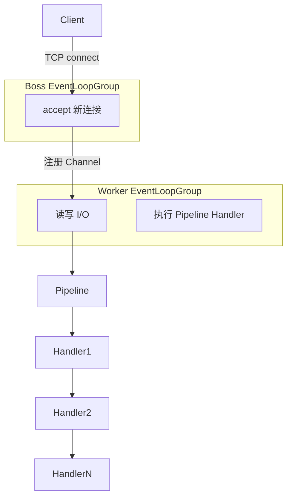

::: tip 保鲜说明（2026-08）
本文基于 **Netty 4.1.x**（`io.netty`）编写，示例使用 Java 17+。Netty 5 仍处于实验阶段，生产环境仍以 4.1 为主。与 Spring WebFlux 的对比基于 Spring Boot 3.4 + Reactor Netty 现状。
:::

## 1. 为什么需要 Netty？

Java 原生 `Socket` / `NIO` 能写网络程序，但生产级服务通常还要自己处理：

| 痛点 | Netty 提供的方案 |
|------|------------------|
| 多路复用与线程模型复杂 | `EventLoopGroup` 统一调度 |
| 粘包/半包 | `ByteToMessageDecoder` 等编解码器 |
| 内存拷贝多 | `ByteBuf` 池化与零拷贝思路 |
| 扩展性差 | `ChannelPipeline` 责任链 |
| 协议栈重复造轮子 | HTTP/2、WebSocket、gRPC 等成熟模块 |

**典型使用场景**：RPC 框架（Dubbo、gRPC）、消息中间件、游戏服务器、API 网关数据面、物联网长连接、自定义二进制协议。

---

## 2. 核心架构一览



**一条连接的生命周期**：

1. `ServerBootstrap` 绑定端口，`Boss` 线程 `accept` 新连接。
2. 将 `Channel` 注册到 `Worker` 的某个 `EventLoop`（同连接后续 I/O 始终在同一线程）。
3. 数据经 `ChannelPipeline` 上的 `ChannelHandler` 链处理。
4. 业务逻辑在 Handler 中读写 `ByteBuf` 或已解码的消息对象。

---

## 3. EventLoop 与 EventLoopGroup

### 3.1 概念

- **EventLoop**：单线程事件循环，负责 I/O 就绪通知 + 执行该 Channel 上的任务队列。
- **EventLoopGroup**：一组 EventLoop，新连接按某种策略（默认轮询）分配到某个 EventLoop。

```java
// 服务端常用：1 个 Boss + N 个 Worker（N 通常为 CPU 核数 × 2）
EventLoopGroup bossGroup = new NioEventLoopGroup(1);
EventLoopGroup workerGroup = new NioEventLoopGroup();

try {
    ServerBootstrap bootstrap = new ServerBootstrap();
    bootstrap.group(bossGroup, workerGroup)
        .channel(NioServerSocketChannel.class)
        // ...
        ;
} finally {
    bossGroup.shutdownGracefully();
    workerGroup.shutdownGracefully();
}
```

### 3.2 线程模型要点

| 规则 | 说明 |
|------|------|
| 同 Channel 同线程 | 避免 Handler 内加锁，但 Handler 不能阻塞 EventLoop |
| 跨线程写 | 使用 `channel.write()` 会派发到正确 EventLoop |
| 阻塞操作 | 丢到业务线程池，完成后 `ctx.executor().execute(...)` 回写 |

```java
// 错误：在 Handler 里 Thread.sleep 会卡住整个 EventLoop 上所有 Channel
// 正确：业务线程池处理
private final ExecutorService bizPool = Executors.newFixedThreadPool(32);

@Override
protected void channelRead0(ChannelHandlerContext ctx, String msg) {
    bizPool.submit(() -> {
        String result = heavyCompute(msg);
        ctx.channel().eventLoop().execute(() -> ctx.writeAndFlush(result));
    });
}
```

### 3.3 其他 EventLoop 实现

| 实现 | 场景 |
|------|------|
| `NioEventLoopGroup` | Linux/macOS 通用 TCP |
| `EpollEventLoopGroup` | Linux 上 epoll 优化版 |
| `KQueueEventLoopGroup` | macOS/BSD |
| `OioEventLoopGroup` | 阻塞 BIO（测试/兼容） |

---

## 4. Channel 与 ChannelFuture

### 4.1 Channel 是什么？

`Channel` 是对底层 `java.nio.channels.SocketChannel` 等的抽象，提供统一 API：

```java
Channel channel = ...;
channel.isActive();          // 是否打开且已连接
channel.remoteAddress();     // 对端地址
channel.pipeline();            // 获取 Pipeline
channel.writeAndFlush(buf);  // 异步写
```

### 4.2 ChannelFuture / ChannelPromise

Netty I/O 均为**异步**：

```java
ChannelFuture future = bootstrap.connect("127.0.0.1", 9000);
future.addListener((ChannelFutureListener) f -> {
    if (f.isSuccess()) {
        System.out.println("连接成功");
    } else {
        f.cause().printStackTrace();
    }
});
// 同步等待（慎用，会阻塞调用线程）
// future.sync();
```

### 4.3 常用 Channel 类型

| 类型 | 角色 |
|------|------|
| `NioServerSocketChannel` | 服务端监听 |
| `NioSocketChannel` | 客户端 TCP |
| `NioDatagramChannel` | UDP |

---

## 5. ChannelPipeline 与 ChannelHandler

### 5.1 Pipeline 责任链

入站（inbound）：`channelRead` 从 head → tail  
出站（outbound）：`write` 从 tail → head

```java
bootstrap.childHandler(new ChannelInitializer<SocketChannel>() {
    @Override
    protected void initChannel(SocketChannel ch) {
        ChannelPipeline p = ch.pipeline();
        p.addLast("frameDecoder", new LineBasedFrameDecoder(1024));
        p.addLast("stringDecoder", new StringDecoder(CharsetUtil.UTF_8));
        p.addLast("stringEncoder", new StringEncoder(CharsetUtil.UTF_8));
        p.addLast("bizHandler", new EchoServerHandler());
    }
});
```

### 5.2 Handler 分类

| 基类 | 方向 | 典型用途 |
|------|------|----------|
| `ChannelInboundHandlerAdapter` | 入站 | 读数据、连接建立 |
| `ChannelOutboundHandlerAdapter` | 出站 | 写数据、flush |
| `ChannelDuplexHandler` | 双向 | 编解码一体 |
| `SimpleChannelInboundHandler<T>` | 入站 | 自动释放引用，类型明确 |

### 5.3 上下文与传播

```java
public class EchoServerHandler extends SimpleChannelInboundHandler<String> {

    @Override
    public void channelActive(ChannelHandlerContext ctx) {
        ctx.writeAndFlush("welcome\n");
    }

    @Override
    protected void channelRead0(ChannelHandlerContext ctx, String msg) {
        // 回显
        ctx.writeAndFlush(msg);
        // 或传给下一个 inbound：ctx.fireChannelRead(msg);
    }

    @Override
    public void exceptionCaught(ChannelHandlerContext ctx, Throwable cause) {
        cause.printStackTrace();
        ctx.close();
    }
}
```

**`@Sharable`**：无状态 Handler 可复用同一实例；有状态（如计数器）必须每连接 new。

---

## 6. ByteBuf 深入

### 6.1 为什么不用 byte[]？

| 特性 | `byte[]` | `ByteBuf` |
|------|----------|-----------|
| 读写索引 | 需自己维护 offset | `readerIndex` / `writerIndex` |
| 扩容 | 手动拷贝 | 自动扩容 |
| 池化 | 无 | `PooledByteBufAllocator` |
| 引用计数 | GC | `retain()` / `release()` 手动管理 |

### 6.2 三种类型

```java
// 1. 堆内存
ByteBuf heap = Unpooled.buffer(256);

// 2. 直接内存（减少 JVM 堆与内核拷贝）
ByteBuf direct = Unpooled.directBuffer(256);

// 3. 包装已有数组（零拷贝视图）
ByteBuf wrapped = Unpooled.wrappedBuffer("hello".getBytes(StandardCharsets.UTF_8));
```

### 6.3 读写 API 速查

```java
ByteBuf buf = ctx.alloc().buffer();
buf.writeInt(42);
buf.writeBytes("Netty".getBytes(StandardCharsets.UTF_8));

int n = buf.readInt();
byte[] bytes = new byte[5];
buf.readBytes(bytes);

System.out.println("readable=" + buf.readableBytes());
// 用完必须 release（SimpleChannelInboundHandler 对最后消息会自动 release）
buf.release();
```

### 6.4 内存泄漏排查

启动参数：

```text
-Dio.netty.leakDetection.level=PARANOID   # 开发
-Dio.netty.leakDetection.level=SIMPLE     # 生产可开 SIMPLE
```

规则：**谁 last access，谁 release**；在 Handler 里把 `ByteBuf` 传给下游时要 `retain()`。

---

## 7. 编解码与粘包半包

TCP 是字节流，应用层消息边界需自己定义。

### 7.1 常见策略

| 策略 | Netty 组件 |
|------|------------|
| 换行分隔 | `LineBasedFrameDecoder` |
| 固定长度 | `FixedLengthFrameDecoder` |
| 长度字段前缀 | `LengthFieldBasedFrameDecoder` |
| 自定义分隔符 | `DelimiterBasedFrameDecoder` |

```java
// 协议：[4字节长度][body]
p.addLast(new LengthFieldBasedFrameDecoder(
    1024 * 1024,  // maxFrameLength
    0,            // lengthFieldOffset
    4,            // lengthFieldLength
    0,            // lengthAdjustment
    4             // initialBytesToStrip（剥掉长度字段）
));
p.addLast(new LengthFieldPrepender(4)); // 出站自动加长度头
```

### 7.2 对象与 JSON

```java
// 使用 Netty 自带或 Protobuf
// pipelie.addLast(new ProtobufDecoder(MyMessage.getDefaultInstance()));
// 或配合 Jackson：
p.addLast(new MessageToMessageEncoder<String>() {
    @Override
    protected void encode(ChannelHandlerContext ctx, String msg, List<Object> out) {
        byte[] json = objectMapper.writeValueAsBytes(msg);
        ByteBuf buf = ctx.alloc().buffer(4 + json.length);
        buf.writeInt(json.length);
        buf.writeBytes(json);
        out.add(buf);
    }
});
```

---

## 8. 完整 TCP Echo Server / Client

### 8.1 Maven 依赖

```xml
<dependency>
    <groupId>io.netty</groupId>
    <artifactId>netty-all</artifactId>
    <version>4.1.118.Final</version>
</dependency>
```

### 8.2 Echo Server

```java
public class NettyEchoServer {

    private final int port;

    public NettyEchoServer(int port) {
        this.port = port;
    }

    public void start() throws InterruptedException {
        EventLoopGroup boss = new NioEventLoopGroup(1);
        EventLoopGroup worker = new NioEventLoopGroup();
        try {
            ServerBootstrap b = new ServerBootstrap();
            b.group(boss, worker)
                .channel(NioServerSocketChannel.class)
                .option(ChannelOption.SO_BACKLOG, 128)
                .childOption(ChannelOption.SO_KEEPALIVE, true)
                .childOption(ChannelOption.TCP_NODELAY, true)
                .childHandler(new ChannelInitializer<SocketChannel>() {
                    @Override
                    protected void initChannel(SocketChannel ch) {
                        ch.pipeline()
                            .addLast(new LineBasedFrameDecoder(8192))
                            .addLast(new StringDecoder(StandardCharsets.UTF_8))
                            .addLast(new StringEncoder(StandardCharsets.UTF_8))
                            .addLast(new EchoServerHandler());
                    }
                });

            ChannelFuture f = b.bind(port).sync();
            System.out.println("Echo server started on port " + port);
            f.channel().closeFuture().sync();
        } finally {
            boss.shutdownGracefully();
            worker.shutdownGracefully();
        }
    }

    public static void main(String[] args) throws InterruptedException {
        new NettyEchoServer(9000).start();
    }
}
```

### 8.3 Echo Client

```java
public class NettyEchoClient {

    public static void main(String[] args) throws Exception {
        EventLoopGroup group = new NioEventLoopGroup();
        try {
            Bootstrap b = new Bootstrap();
            b.group(group)
                .channel(NioSocketChannel.class)
                .option(ChannelOption.TCP_NODELAY, true)
                .handler(new ChannelInitializer<SocketChannel>() {
                    @Override
                    protected void initChannel(SocketChannel ch) {
                        ch.pipeline()
                            .addLast(new LineBasedFrameDecoder(8192))
                            .addLast(new StringDecoder(StandardCharsets.UTF_8))
                            .addLast(new StringEncoder(StandardCharsets.UTF_8))
                            .addLast(new SimpleChannelInboundHandler<String>() {
                                @Override
                                public void channelActive(ChannelHandlerContext ctx) {
                                    ctx.writeAndFlush("hello netty\n");
                                }

                                @Override
                                protected void channelRead0(ChannelHandlerContext ctx, String msg) {
                                    System.out.println("server: " + msg.trim());
                                    ctx.close();
                                }
                            });
                    }
                });

            ChannelFuture f = b.connect("127.0.0.1", 9000).sync();
            f.channel().closeFuture().sync();
        } finally {
            group.shutdownGracefully();
        }
    }
}
```

### 8.4 测试

```bash
# 终端 1
java -cp target/classes com.example.NettyEchoServer

# 终端 2
java -cp target/classes com.example.NettyEchoClient
# 或
nc 127.0.0.1 9000
```

---

## 9. 启动参数与调优

### 9.1 常用 ChannelOption

| Option | 作用 |
|--------|------|
| `SO_BACKLOG` | 全连接队列长度 |
| `SO_KEEPALIVE` | TCP keepalive |
| `TCP_NODELAY` | 禁用 Nagle，降低延迟 |
| `ALLOCATOR` | 指定 `PooledByteBufAllocator.DEFAULT` |
| `WRITE_BUFFER_WATER_MARK` | 写缓冲高低水位，反压 |

```java
bootstrap.childOption(ChannelOption.ALLOCATOR, PooledByteBufAllocator.DEFAULT);
bootstrap.childOption(ChannelOption.WRITE_BUFFER_WATER_MARK,
    new WriteBufferWaterMark(32 * 1024, 64 * 1024));
```

### 9.2 资源限制

```java
// 限制单连接内存（防 OOM）
bootstrap.childOption(ChannelOption.RCVBUF_ALLOCATOR,
    new AdaptiveRecvByteBufAllocator(64, 1024, 65536));
```

---

## 10. Netty vs Spring WebFlux：何时选谁？

| 维度 | Netty（裸或作底层） | Spring WebFlux |
|------|---------------------|----------------|
| 抽象层级 | 字节/帧/连接级 | HTTP 路由、注解、响应式类型 |
| 协议 | 任意 TCP/UDP/自定义 | 主要是 HTTP/WebSocket |
| 生态 | 需自建或接 gRPC 等 | Spring Security、Actuator、Data |
| 学习曲线 | 陡 | 熟悉 Spring 则平缓 |
| 适用团队 | 中间件、游戏、IoT | 业务 API、BFF、网关 |

### 10.1 选 Netty 的场景

- 自定义二进制协议、长连接推送（非标准 WebSocket 栈）。
- 对延迟/吞吐有极致要求，需要精细控制内存与线程。
- 构建框架级组件（RPC、MQ、代理），而非 CRUD REST。

### 10.2 选 WebFlux 的场景

- 标准 REST / SSE / WebSocket API，要与 Spring 生态集成。
- 团队以业务开发为主，不想维护 Pipeline 与 ByteBuf 生命周期。
- 需要 `@RestController`、`WebClient`、R2DBC 等统一响应式栈。

> **关系**：Spring WebFlux 默认运行在 **Reactor Netty** 上——底层仍是 Netty，上层是 Spring 抽象。复杂协议可在 Netty 层扩展，HTTP 业务用 WebFlux 即可。

```java
// WebFlux 极简 Echo（HTTP 层，非 TCP 裸连）
@RestController
public class EchoController {
    @PostMapping("/echo")
    public Mono<String> echo(@RequestBody Mono<String> body) {
        return body.map(String::toUpperCase);
    }
}
```

### 10.3 混合架构示例

```text
[设备] --自定义 TCP--> [Netty 接入层] --Kafka--> [Spring Boot 业务服务]
[浏览器] --HTTP--> [Spring Cloud Gateway] --WebFlux--> [微服务]
```

接入层用 Netty 扛连接数；业务层用 WebFlux/MVC 做编排与持久化。

---

## 11. 常见坑与排查

| 现象 | 原因 | 处理 |
|------|------|------|
| 连接假死 | Handler 阻塞 EventLoop | 业务线程池 + 回 EventLoop 写 |
| 内存涨不停 | ByteBuf 未 release | leak detection + 规范 retain/release |
| 粘包乱码 | 无帧解码器 | LengthField / 换行 / 自定义协议 |
| 端口占用重启失败 | `SO_REUSEADDR` 未开 | `b.option(ChannelOption.SO_REUSEADDR, true)` |
| 优雅停机丢消息 | 直接 `kill -9` | `shutdownGracefully` + 等待 in-flight |

---

## 12. 学习路径建议

1. 跑通本章 Echo，用 `nc`/`telnet` 手动发数据观察 Pipeline。
2. 把协议改成「4 字节长度 + JSON」，练习 `LengthFieldBasedFrameDecoder`。
3. 加一个「心跳 Handler」：`IdleStateHandler` + 超时关连接。
4. 阅读 Dubbo、gRPC-Java 的 Netty 模块源码（真实生产用法）。
5. 对比同一 API 的 WebFlux 实现，理解抽象边界。

---

## 13. 速查表

```text
Bootstrap          → 客户端
ServerBootstrap    → 服务端
EventLoopGroup     → 线程池（事件循环）
Channel            → 连接
ChannelPipeline    → Handler 链
ByteBuf            → 字节容器（注意 release）
ChannelHandlerContext → 当前 Handler 上下文，用于传播与写
writeAndFlush      → 异步写并刷新
shutdownGracefully → 优雅关闭
```

---

## 14. 参考

- [Netty 4.x User Guide](https://netty.io/wiki/user-guide-for-4.x.html)
- [Netty in Action](https://www.manning.com/books/netty-in-action)（经典书）
- 本仓库：[Java NIO 详解](/java/nio-tutorial/)、[Java 网络编程教程](/java/rli40g2k/)
