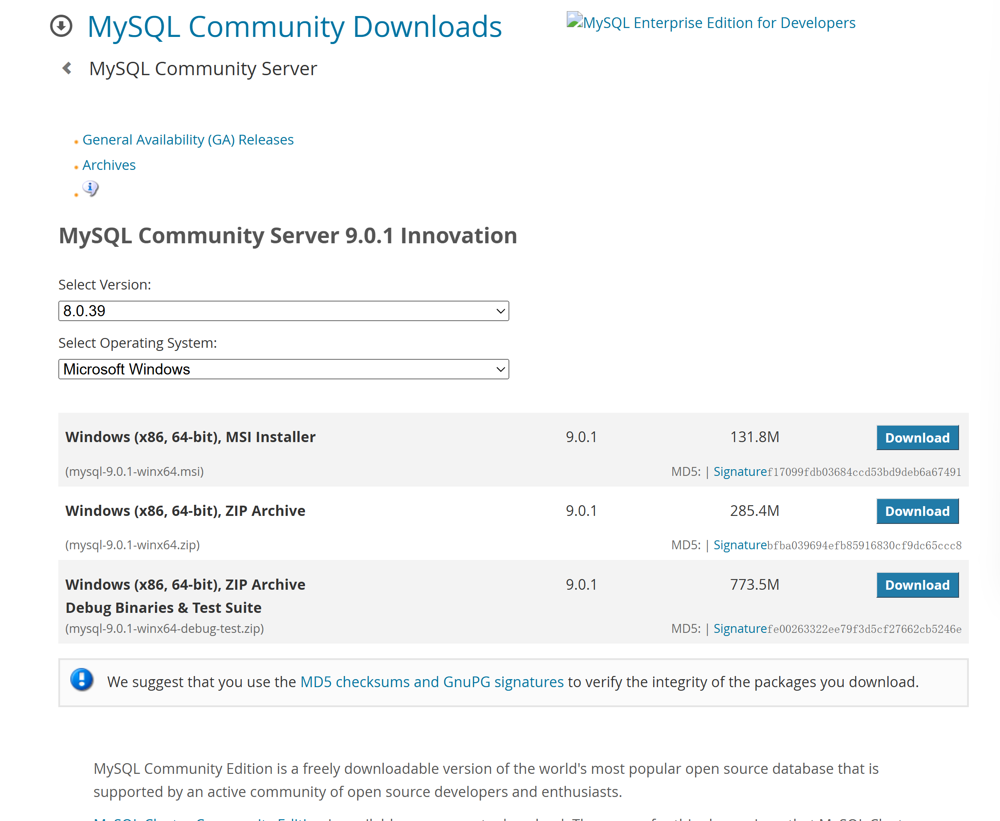
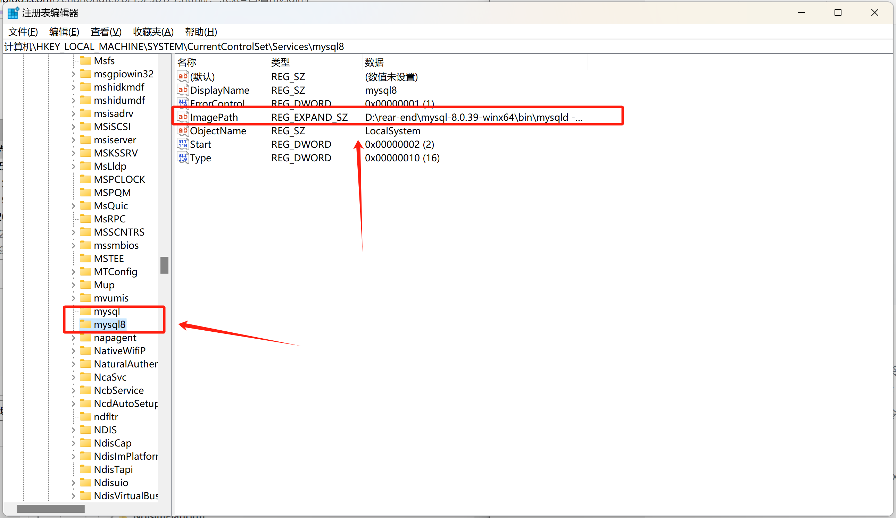
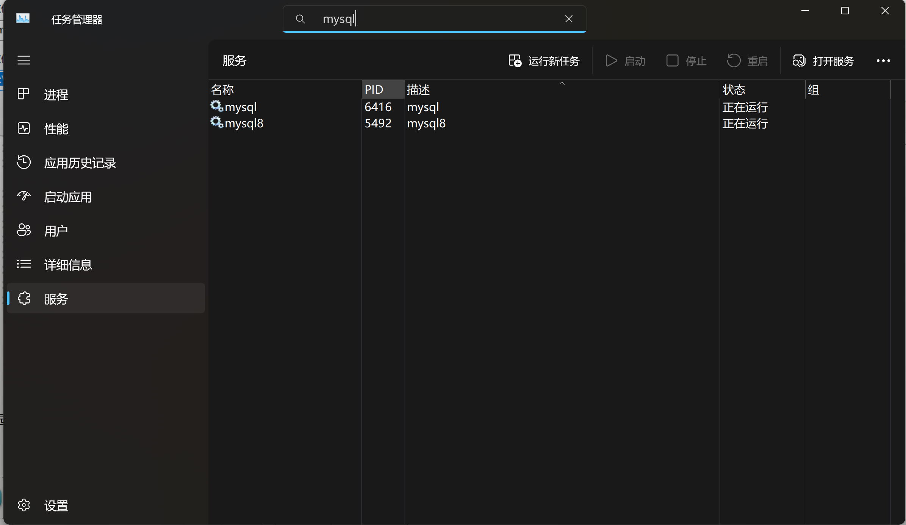

# MySQL 安装与配置

## 一、Windows 系统安装

### 推荐：使用压缩包安装

这种方法便于管理和删除，不需要时可以直接删除。

1. **下载 MySQL 压缩包**

   - [历史旧版本下载](https://downloads.mysql.com/archives/community/)
   - [新版本下载](https://dev.mysql.com/downloads/mysql/)

   

2. **创建 `my.ini` 配置文件**

   在 MySQL 根目录下创建 `my.ini` 文件，内容如下：

   ```ini
   # 客户端配置
   [client]
   default-character-set = utf8mb4

   # MySQL命令行工具配置
   [mysql]
   default-character-set = utf8mb4

   # MySQL服务器配置
   [mysqld]
   port = 3307
   character-set-server = utf8mb4
   collation-server = utf8mb4_unicode_ci
   init_connect='SET NAMES utf8mb4'
   default_storage_engine = InnoDB
   ```

3. **初始化数据库**

   打开命令提示符，以管理员权限进入 MySQL `bin` 目录，执行以下命令之一：

   ```bash
   mysqld --initialize --console  # 生成一个临时登录密码
   mysqld --initialize-insecure   # 不生成临时密码，默认无密码
   ```

   执行成功后会生成 `data` 文件夹。

4. **创建 MySQL 服务**

   执行以下命令创建服务：

   ```bash
   mysqld install 服务名 --defaults-file="路径\my.ini"
   ```

   服务创建后，可以在注册表中修改路径：

   ```
   HKEY_LOCAL_MACHINE\SYSTEM\CurrentControlSet\Services\你的服务名
   ```

   

5. **启动 MySQL 服务**

   使用 Windows 服务管理器启动 MySQL 服务。可以安装多个版本，分别配置不同的服务名。

   

6. **修改密码**

   使用以下 SQL 命令修改密码：

   ```sql
   ALTER USER 'user'@'localhost' IDENTIFIED BY 'newpassword';
   ```

## 二、Linux 系统安装（以 Ubuntu 为例）

### 安装步骤

1. **更新系统包**

   在安装 MySQL 前，先更新系统包：

   ```bash
   sudo apt update
   sudo apt upgrade
   ```

2. **安装 MySQL 服务器**

   使用以下命令安装：

   ```bash
   sudo apt install mysql-server
   ```

   安装过程中可能不会提示设置密码，此时默认无密码。

3. **启动 MySQL 服务**

   安装完成后，MySQL 服务会自动启动。使用以下命令查看状态：

   ```bash
   systemctl status mysql
   ```

   

   如果没有启动，使用以下命令启动：

   ```bash
   systemctl start mysql
   ```

4. **登录 MySQL**

   使用以下命令登录 MySQL：

   ```bash
   mysql -u root -p
   ```

   

   如果没有设置密码，可以通过以下命令查看默认用户名和密码：

   ```bash
   sudo cat /etc/mysql/debian.cnf
   ```

   

5. **修改 `root` 密码**

   登录后，使用以下命令修改密码：

   ```sql
   ALTER USER 'root'@'localhost' IDENTIFIED BY 'new_password'; 
   ```

   如果需要远程访问，使用以下命令：

   ```sql
   ALTER USER 'root'@'%' IDENTIFIED BY 'new_password';
   ```

   版本 5.7 以下使用：

   ```sql
   SET PASSWORD FOR 'root'@'localhost' = PASSWORD('new_password');
   ```

   刷新权限：

   ```sql
   FLUSH PRIVILEGES;
   ```

### 远程连接问题排查

1. **检查防火墙**

   确保防火墙开放了 3306 端口。

2. **检查 MySQL 用户权限**

   使用以下命令查看权限：

   ```sql
   USE mysql;
   SELECT user, host FROM user WHERE user = 'root';
   ```

   

   如果 `host` 不是 `%`，使用以下命令更新：

   ```sql
   UPDATE user SET host='%' WHERE user='root';
   ```

3. **修改配置文件**

   修改 MySQL 配置文件以允许远程连接：

   ```bash
   sudo vi /etc/mysql/mysql.conf.d/mysqld.cnf
   ```

   将 `bind-address` 修改为 `0.0.0.0`


