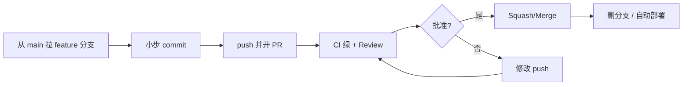

::: tip 保鲜说明（2026-08）
Conventional Commits 与 Angular 规范一脉相承，被 **semantic-release**、**commitlint**、GitHub/GitLab 发布说明生成广泛采用。本文 PR 流程以 GitHub Pull Request 为例，GitLab MR 概念等价。
:::

## 1. 为什么需要规范？

| 无规范时 | 有规范后 |
|----------|----------|
| commit 信息「fix」「update」 | 一眼看出类型与影响范围 |
| PR 巨大、难审 | 小步提交、可追踪 |
| 发版靠人工整理 changelog | 自动生成 Release Notes |
| review 人身攻击或流于形式 | 对事不对人，有检查清单 |

**目标**：提升代码质量、知识共享、降低线上事故，而不是「走流程」。

---

## 2. Pull Request 工作流



### 2.1 PR 粒度

| 建议 | 反例 |
|------|------|
| 单一职责：一个 bug 或一个功能 | 「顺便重构整个模块」 |
| < 400 行有效 diff（经验值） | 3000 行「大爆炸」 |
| 可独立回滚 | 10 个无关需求塞一个 PR |

### 2.2 PR 描述模板

```markdown
## 变更说明
简要描述做了什么、为什么做。

## 变更类型
- [ ] 新功能
- [ ] Bug 修复
- [ ] 重构（无行为变化）
- [ ] 文档
- [ ] 依赖升级

## 如何验证
1. 启动 `make dev`
2. 访问 `/api/xxx`，期望返回 200
3. 单元测试：`mvn test -Dtest=XxxTest`

## 关联
Closes #123

## 截图 / 日志（如适用）

## Checklist
- [ ] 已自测
- [ ] 已更新文档/注释（如需要）
- [ ] 无敏感信息（密钥、内网地址）
```

---

## 3. PR Review 检查清单

### 3.1 功能与正确性

- [ ] 是否满足需求/验收标准？
- [ ] 边界条件：空值、越界、并发、重复提交？
- [ ] 错误处理是否完整？用户能否感知失败原因？
- [ ] 是否存在明显性能问题（N+1 查询、大循环、无分页）？

### 3.2 设计与可维护性

- [ ] 命名是否表达意图？
- [ ] 是否重复造轮子？能否复用现有模块？
- [ ] 抽象层级是否合适（不过度设计）？
- [ ] 公共 API 变更是否向后兼容或有迁移说明？

### 3.3 安全

- [ ] 输入校验、鉴权、越权（IDOR）？
- [ ] SQL/命令注入、XSS、敏感数据日志？
- [ ] 密钥是否进仓库？应使用环境变量/Secret Manager。

### 3.4 测试

- [ ] 关键路径有单元/集成测试？
- [ ] 测试是否稳定（无随机 sleep、依赖顺序）？
- [ ] CI 是否通过（lint、test、build）？

### 3.5 运维与可观测

- [ ] 新依赖、配置项、迁移脚本是否文档化？
- [ ] 日志级别合理？关键业务有 traceId/metrics？
- [ ] Feature flag 或灰度策略（大改动）？

### 3.6 前端专项（如适用）

- [ ] 无障碍、响应式、加载/错误态？
- [ ] 无控制台 error；bundle 体积可接受？

---

## 4. Review 礼仪

### 4.1 评论分级

| 标记 | 含义 |
|------|------|
| **nit** | 可选优化，不阻塞合并 |
| **question** | 求解释，非指责 |
| **suggestion** | 建议改法，作者可采纳或回复理由 |
| **blocker** | 必须修复才能合并 |

示例：

```text
suggestion: 这里可以用 `Optional.orElseThrow` 减少嵌套。

question: 为什么选择先删缓存再写 DB？我们文档写的是反过来的。

blocker: 该接口未校验 `userId`，存在越权风险。
```

### 4.2 Reviewer 原则

- 对**代码**不对人；假设作者善意。
- 指出问题时尽量给**理由 + 可选方案**。
- 及时 Review（如 1 个工作日内）；大 PR 可约同步走读。
- LGTM（Looks Good To Me）前确认 CI 绿、blocker 已解决。

### 4.3 Author 原则

- PR 前先**自审**一遍 diff。
- 回复每条评论：已改 / 不同意因为… / 后续 issue 跟进。
- 不要 force-push 后不留说明（改历史需团队约定）。
- 感谢 reviewer 的时间。

### 4.4 避免

- 「这写的什么玩意」
- 在 PR 里争论架构却不拉会对齐
- 未经讨论的大范围「顺手改风格」

---

## 5. Conventional Commits 规范

### 5.1 基本格式

```text
<type>[optional scope]: <description>

[optional body]

[optional footer(s)]
```

示例：

```text
feat(order): 支持优惠券叠加计算

修复满减与折扣券同时使用的精度问题。
Closes #456

BREAKING CHANGE: 订单金额字段从 int 分改为 BigDecimal 元
```

### 5.2 常用 type

| type | 含义 | 语义化版本 |
|------|------|------------|
| `feat` | 新功能 | MINOR |
| `fix` | Bug 修复 | PATCH |
| `docs` | 仅文档 | — |
| `style` | 格式（不影响逻辑） | — |
| `refactor` | 重构 | — |
| `perf` | 性能优化 | PATCH |
| `test` | 测试 | — |
| `build` | 构建/依赖 | — |
| `ci` | CI 配置 | — |
| `chore` | 杂项（不产生产物） | — |
| `revert` | 回滚 | PATCH |

带 `BREAKING CHANGE:` 或类型后 `!`（如 `feat!:`）→ **MAJOR**。

### 5.3 scope 写法

scope 表示影响模块，团队统一即可：

```text
feat(auth): 增加 OAuth2 登录
fix(redis): 修正 TTL 单位错误
chore(deps): 升级 Spring Boot 3.4.5
```

### 5.4 description 规则

- 使用**祈使句**：「增加」「修复」而非「增加了」「修复了」
- 首字母小写（英文团队常见）
- 结尾不加句号
- 一行 ≤ 72 字符（body 可长）

### 5.5 body 与 footer

```text
fix(api): 分页参数校验

pageSize 超过 100 时曾导致 OOM。
现限制最大 100 并返回 400。

Reviewed-by: Alice
Refs: JIRA-789
```

---

## 6. 分支命名规范

### 6.1 推荐模式

```text
<type>/<ticket>-<short-description>
```

| 类型 | 示例 |
|------|------|
| feature | `feature/PROJ-123-user-login` |
| bugfix | `bugfix/PROJ-456-null-pointer-checkout` |
| hotfix | `hotfix/PROJ-789-payment-timeout` |
| chore | `chore/update-dependencies` |
| release | `release/1.2.0` |

### 6.2 约定细节

- 全小写，单词用 `-` 连接
- 含 ticket 号便于追溯（Jira/Linear/GitHub Issue）
- **短命分支**：合并后删除
- 保护 `main`/`master`：禁止直接 push，必须 PR

### 6.3 与 Conventional Commits 对齐

分支名 `feature/` 对应 commit `feat:`，reviewer 一眼识别意图。

---

## 7. 工具链集成

### 7.1 commitlint

```bash
npm install -D @commitlint/cli @commitlint/config-conventional husky

# commitlint.config.js
module.exports = { extends: ['@commitlint/config-conventional'] };
```

```bash
# .husky/commit-msg
npx --no -- commitlint --edit "$1"
```

### 7.2 semantic-release（自动发版）

根据 commit 类型计算版本号、生成 changelog、打 tag、发布 npm/Maven 等。

### 7.3 GitHub PR 标题

团队可要求 **Squash merge 时 PR 标题必须符合 Conventional Commits**，合并后主干历史干净：

```text
feat(payment): 接入微信支付 v3 (#1024)
```

---

## 8. Merge 策略选择

| 策略 | 优点 | 缺点 |
|------|------|------|
| **Squash merge** | 主干线性、一 PR 一 commit | 丢失分支内细粒度历史 |
| **Merge commit** | 保留完整分支历史 | 主干分叉多 |
| **Rebase merge** | 线性 + 保留多 commit | 冲突处理在作者侧 |

**建议**：业务仓库用 **Squash** + 规范 PR 标题；开源库可用 rebase 保留贡献者 commit。

---

## 9. 反例与正例对照

### 9.1 Commit message

| 差 | 好 |
|----|-----|
| `fix bug` | `fix(cart): 修复数量为 0 时仍可结算` |
| `update` | `chore(deps): bump lombok to 1.18.34` |
| `WIP` | （不要合入主干；用 draft PR） |
| `feat: add feature fix typo docs` | 拆成多个 commit 或 squash 前整理 |

### 9.2 PR

| 差 | 好 |
|----|-----|
| 标题「更新」 | `refactor(user): 提取密码校验到独立服务` |
| 无描述、无测试 | 模板填满、CI 链接 |
| 200 文件格式化混在功能里 | 风格单独 PR |

---

## 10. Code Review 深度指南

### 10.1 先广后深

1. 读 PR 描述与测试计划
2. 扫文件列表，看架构影响
3. 精读核心逻辑 diff
4. 扫测试与配置变更

### 10.2 自动化优先

让人审**业务逻辑**；格式、import、简单 bug 交给：

- ESLint / Checkstyle / SpotBugs
- SonarQube
- 依赖漏洞扫描

### 10.3 知识传递

对新人友好：解释「为什么」而不仅是「改掉」。可链到内部 wiki 或 ADR（Architecture Decision Record）。

### 10.4 何时批准

- 所有 **blocker** 已解决
- CI 通过（或豁免已记录）
- 你愿为此代码**共同负责**上线

---

## 11. 团队角色与职责

| 角色 | 职责 |
|------|------|
| Author | 小 PR、自测、积极响应 |
| Reviewer | 及时、建设性、区分 blocker/nit |
| Maintainer | 定规范、仲裁争议、守护主干质量 |
| Tech Lead | 大方向 ADR、豁免流程 |

**CODEOWNERS** 示例：

```text
# .github/CODEOWNERS
/src/main/java/com/example/payment/ @payment-team
*.md @docs-team
```

---

## 12. 热修复（hotfix）流程

```text
main ──●──●──●── (prod)
        \
hotfix/xxx ──●── PR（ expedited review ）
              └── merge → tag v1.2.1 → 部署
              └── cherry-pick → develop
```

- commit：`fix(critical): 支付回调空指针`
- 至少 1 名 senior approve + 事后补测试

---

## 13. 与 Issue 联动

```text
feat: 新增导出 CSV 功能

Closes #100
Refs #98
```

| 关键词 | 效果（GitHub） |
|--------|----------------|
| Closes / Fixes | 合并后关闭 issue |
| Refs / Related | 仅关联 |

---

## 14. 中文团队实践建议

- Commit **type/scope 用英文**，description 可用中文（工具兼容性好）：

```text
feat(订单): 支持批量发货接口
```

- 或全英文便于国际化开源：

```text
feat(order): add batch shipment API
```

- 团队选一种，**文档写死**，commitlint 可自定义规则。

---

## 15. 评审会议（可选）

大改动或架构迁移：

1. 作者 15 分钟讲背景与方案
2. 预先发设计 doc / ADR
3. 会议记录 action item，PR 里链接纪要

避免：未经设计的 PR 被反复打回。

---

## 16. 度量（仅供参考）

| 指标 | 健康方向 |
|------|----------|
| PR 平均存活时间 | 缩短 |
| 每个 PR 评论数 | 适中（过多可能 PR 过大） |
| Review 轮次 | ≤ 2 轮理想 |
| 主干 broken 次数 | 趋近 0 |

勿唯 KPI：评论数多不等于质量高。

---

## 17. 完整示例：从分支到发布

```bash
git checkout -b feature/PROJ-200-coupon-api

# 开发中多次 commit
git commit -m "feat(coupon): add entity and repository"
git commit -m "feat(coupon): expose REST create endpoint"
git commit -m "test(coupon): add integration test"

git push -u origin feature/PROJ-200-coupon-api
# 开 PR，标题：feat(coupon): 优惠券创建 API
# Review → Squash merge

# 主干自动生成
# v1.3.0 — feat(coupon): 优惠券创建 API (#200)
```

---

## 18. Checklist 汇总（可贴仓库）

**提交前**

- [ ] commit 符合 Conventional Commits
- [ ] 分支名符合规范
- [ ] 本地测试 + lint 通过

**开 PR**

- [ ] 描述完整、关联 issue
- [ ] diff 聚焦、无无关格式化
- [ ] 截图/验证步骤

**Review**

- [ ] 功能/安全/测试/可维护性
- [ ] 标注 blocker / suggestion
- [ ] CI 绿

**合并后**

- [ ] 删分支
- [ ] 关注部署与监控

---

## 19. 参考

- [Conventional Commits 官网](https://www.conventionalcommits.org/)
- [Google Engineering Practices — Code Review](https://google.github.io/eng-practices/review/)
- 本仓库：[Git 工作流详解](/article/git-workflow/)、[Java 开发规范](/article/java-style/)、[REST 接口设计规范](/standards/rest-api-design/)
