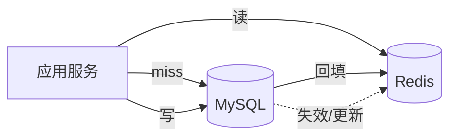
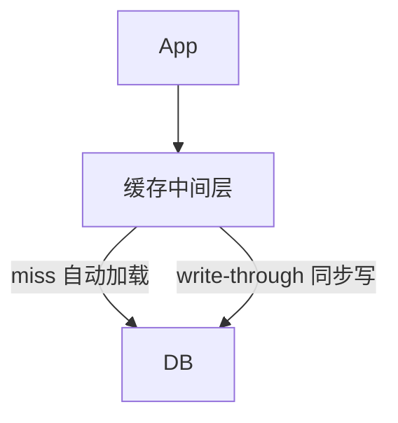

::: tip 保鲜说明（2026-08）
模式与 Redis 版本无关，示例命令以 **Redis 7.x** 为准。Spring 集成可参考本仓库 [SpringBoot 集成 Redis](/article/springboot-redis/)。布隆过滤器使用 **RedisBloom** 模块或 Redisson `RBloomFilter`。
:::

## 1. 为什么需要缓存模式？

直接把 Redis 当「更快的 MySQL」用，容易遇到：

- 缓存与 DB **不一致**
- 热点 key **打穿** Redis 或 DB
- 缓存失效瞬间 **惊群**（Cache Stampede）
- **大 key** 拖慢单线程 Redis

本文整理生产中最常用的读写模式与治理手段。

---

## 2. 缓存架构总览



| 角色 | 职责 |
|------|------|
| Cache-Aside | 应用显式管缓存（最常用） |
| Read/Write-Through | 缓存层代理读写（较少自研） |
| Write-Behind | 异步写 DB（高吞吐、有丢数据风险） |

---

## 3. Cache-Aside（旁路缓存）

### 3.1 读路径

```text
1. 读 Redis key
2. hit → 返回
3. miss → 读 DB → 写入 Redis（设 TTL）→ 返回
```

```java
public Product getProduct(Long id) {
    String key = "product:" + id;
    String cached = redisTemplate.opsForValue().get(key);
    if (cached != null) {
        return objectMapper.readValue(cached, Product.class);
    }
    Product product = productMapper.selectById(id);
    if (product == null) {
        // 可选：缓存空值防穿透
        redisTemplate.opsForValue().set(key, "NULL", Duration.ofMinutes(5));
        return null;
    }
    redisTemplate.opsForValue().set(
        key, objectMapper.writeValueAsString(product), Duration.ofHours(1));
    return product;
}
```

### 3.2 写路径

**推荐：先更新 DB，再删除缓存**（Cache-Aside 标准写法）

```java
@Transactional
public void updateProduct(Product product) {
    productMapper.updateById(product);
    redisTemplate.delete("product:" + product.getId());
}
```

为什么删而不是更新缓存？

- 避免与并发读写的复杂竞态（双写不一致）
- 懒加载：下次读再回填最新值

### 3.3 并发下的经典问题

| 时序 | 问题 |
|------|------|
| A 读 miss → 读 DB 旧值 | |
| B 写 DB 新值 → 删缓存 | |
| A 把旧值写入缓存 | **脏缓存** |

**缓解**：

1. 延迟双删：删缓存 → 写 DB → `sleep(几百 ms)` → 再删一次。
2. 设置较短 TTL，脏数据自动过期。
3. 用 Canal / Debezium 订阅 binlog 异步删缓存（最终一致）。
4. 强一致场景：读写都走 DB，缓存仅作降级。

---

## 4. Read-Through / Write-Through

缓存组件**代理**所有读写，应用只和缓存层交互。



### 4.1 Read-Through

应用调用 `cache.get(key, loader)`，miss 时 loader 读 DB 并写入缓存。

```java
// Guava LoadingCache 思路；Redis 可用自研 CacheService 封装
public <T> T readThrough(String key, Supplier<T> dbLoader, Duration ttl) {
    String val = redis.get(key);
    if (val != null) return deserialize(val);
    T data = dbLoader.get();
    if (data != null) {
        redis.setex(key, ttl, serialize(data));
    }
    return data;
}
```

### 4.2 Write-Through

写操作同时更新缓存和 DB（同一事务语义由缓存层保证）。

```java
public void writeThrough(String key, Product product) {
    productMapper.updateById(product);
    redisTemplate.opsForValue().set(key, serialize(product), TTL);
}
```

| 对比 Cache-Aside | Write-Through |
|------------------|---------------|
| 应用管两套逻辑 | 逻辑集中在 CacheService |
| 灵活 | 实现成本高 |
| 互联网业务主流 | 商业缓存产品（如部分 CDN KV）常见 |

---

## 5. Write-Behind（Write-Back）

写缓存**立即返回**，异步批量刷 DB。

**优点**：写吞吐极高。  
**缺点**：宕机可能丢数据；实现复杂（队列、重试、顺序）。

适用：计数器、点赞数、日志缓冲——可接受短暂丢失或最终一致。

```java
// 伪代码：内存队列 + 定时 flush
blockingQueue.add(new WriteTask(key, delta));
// 后台线程每 500ms batch UPDATE ... SET count = count + ?
```

---

## 6. 缓存穿透、击穿、雪崩

### 6.1 穿透（查不存在的数据）

**现象**：恶意 `id=-1`，缓存无、DB 也无，每次打穿 DB。

**方案**：

| 方案 | 说明 |
|------|------|
| 缓存空值 | `SET key "NULL" EX 300`，注意 value 区分 |
| 布隆过滤器 | 先判「一定不存在」则直接返回（见第 7 节） |
| 接口校验 | id 范围、格式校验 |

### 6.2 击穿（热点 key 过期瞬间）

**现象**：单个极热 key 过期，大量并发同时 miss，涌向 DB。

**方案**：

```java
public Product getWithMutex(Long id) {
    String key = "product:" + id;
    String cached = redis.get(key);
    if (cached != null) return parse(cached);

    String lockKey = "lock:product:" + id;
    boolean locked = redis.set(lockKey, "1", "NX", "EX", 10);
    if (locked) {
        try {
            cached = redis.get(key);  // double check
            if (cached != null) return parse(cached);
            Product p = productMapper.selectById(id);
            redis.setex(key, 3600, serialize(p));
            return p;
        } finally {
            redis.del(lockKey);
        }
    } else {
        Thread.sleep(50);
        return getWithMutex(id);  // 或有限重试
    }
}
```

也可用 **Redisson `RReadWriteLock`** / **单飞（singleflight）** 库。

### 6.3 雪崩（大量 key 同时过期）

**方案**：

- TTL 加随机抖动：`baseTtl + Random(0, 300)` 秒
- 多级缓存：本地 Caffeine + Redis
- Redis 集群 + 限流降级
- 热点 key **永不过期** + 异步更新（逻辑过期，见下）

### 6.4 逻辑过期（热点 key 专用）

```java
// value 结构：{ "data": {...}, "expireAt": 1730000000000 }
public Product getLogicalExpire(Long id) {
    String json = redis.get(key);
    LogicalCache lc = parse(json);
    if (lc.getExpireAt() > System.currentTimeMillis()) {
        return lc.getData();
    }
    // 已逻辑过期：返回旧值，异步刷新
    if (tryLockRefresh(id)) {
        refreshExecutor.submit(() -> reloadAndSet(id));
    }
    return lc.getData();  // 仍返回旧数据，避免击穿
}
```

---

## 7. 布隆过滤器（Bloom Filter）实战

### 7.1 原理

位数组 + 多个 hash 函数。判断「**一定不存在**」或「**可能存在**」（有误判率、无漏判）。

```text
exists(id) == false  →  DB 一定没有，直接返回
exists(id) == true   →  可能真有，继续查缓存/DB
```

### 7.2 RedisBloom 命令

```bash
# 创建：预期 100 万元素，误判率 0.01%
BF.RESERVE product:ids 0.0001 1000000

# 添加已存在的 id（数据预热或写路径）
BF.ADD product:ids 10001

# 查询
BF.EXISTS product:ids 99999999
# (integer) 0  → 一定不存在
```

### 7.3 Redisson 示例

```java
RBloomFilter<Long> bloom = redisson.getBloomFilter("product:ids");
bloom.tryInit(1_000_000L, 0.0001);

// 启动时或 Canal 同步时 ADD
bloom.add(productId);

public Product get(Long id) {
    if (!bloom.contains(id)) {
        return null;
    }
    // ... cache-aside
}
```

### 7.4 注意点

| 点 | 说明 |
|----|------|
| 无法删除单元素 | 删 key 重建或 Counting Bloom |
| 误判 | 多一次 DB 查询，可接受 |
| 预热 | 上线前把已有 id 灌入 |
| 与删数据 | DB 删行后布隆仍「可能存在」→ 靠 TTL/空值兜底 |

---

## 8. 热点 Key（Hot Key）

### 8.1 如何发现

- Redis `redis-cli --hotkeys`（需 `maxmemory-policy` 等配置）
- 客户端采样：`MONITOR`（生产慎用）、代理层统计
- 业务埋点：按 key 访问 QPS 排行

### 8.2 治理手段

| 手段 | 说明 |
|------|------|
| 本地缓存 | Caffeine 缓存热点 1~5 秒，挡 Redis |
| key 拆分 | `hot:product:123` → `hot:product:123:{0..7}` 随机读 |
| 读写分离 | 副本读（注意主从延迟） |
| 限流 | 网关对单 key 限 QPS |
| 永不过期 + 后台更新 | 见逻辑过期 |

```java
// 本地一级缓存
LoadingCache<Long, Product> local = Caffeine.newBuilder()
    .maximumSize(10_000)
    .expireAfterWrite(Duration.ofSeconds(3))
    .build(id -> loadFromRedisOrDb(id));
```

### 8.3 热点迁移（大促）

大促前把预测热点提前灌入 Redis，调高内存副本，应用层加大本地缓存。

---

## 9. 大 Key（Big Key）

### 9.1 什么是大 Key？

经验阈值（单 key）：

| 类型 | 警惕线 |
|------|--------|
| String | value > 10 KB（网上也有 1MB 说法，视 RT 而定） |
| Hash/List/Set/ZSet | 元素 > 5000 或总内存 > 1 MB |

### 9.2 危害

- 删除/序列化阻塞 Redis 单线程（Redis 4+ 有 lazy free）
- 网络传输慢，客户端超时
- 集群迁移 slot 卡顿
- 内存不均

### 9.3 扫描

```bash
redis-cli --bigkeys
# 或 SCAN + DEBUG OBJECT（旧版）/ MEMORY USAGE key
```

### 9.4 拆分与治理

```java
// 反例：整个商品列表塞进一个 JSON String
redis.set("all:products", hugeJson);

// 正例：分页 Hash
// product:list:page:1 → Hash field=id value=json
// 或按 id 独立 key + ZSET 索引
```

| 类型 | 拆分方式 |
|------|----------|
| 大 Hash | `hash:tag:part:0` ~ `part:N` 按 field hash |
| 大 List | 分段 list + 元数据记录段数 |
| 大 ZSet | 按 score 范围分 key |
| 大 String | 压缩（gzip）+ 拆 chunk + `MGET` 组装 |

删除大 key：

```bash
UNLINK bigkey   # 异步释放，优于 DEL
```

配置：

```conf
lazyfree-lazy-user-del yes
```

---

## 10. 一致性级别选型

| 业务 | 推荐 |
|------|------|
| 商品详情浏览 | Cache-Aside + TTL + 更新删缓存 |
| 库存扣减 | 不走普通缓存；Redis 原子 decr / Lua / DB 行锁 |
| 配置/字典 | 长 TTL + 发布订阅刷新 |
| 用户 Session | Redis 为准，短 TTL |
|  feed 时间线 | Write-Behind 或专门 Timeline 服务 |

---

## 11. 与 Spring Cache 注解结合

```java
@Cacheable(value = "product", key = "#id", unless = "#result == null")
public Product findById(Long id) {
    return productMapper.selectById(id);
}

@CacheEvict(value = "product", key = "#product.id")
public void update(Product product) {
    productMapper.updateById(product);
}
```

```yaml
spring:
  cache:
    type: redis
  data:
    redis:
      host: localhost
      port: 6379
```

自定义 `RedisCacheConfiguration` 统一 TTL 与 key 前缀 `app:cache:`。

---

## 12. Lua 脚本保证原子性

库存示例（防超卖 + 缓存一致）：

```lua
-- KEYS[1]=stock:key  ARGV[1]=扣减数量
local stock = tonumber(redis.call('GET', KEYS[1]) or '0')
local n = tonumber(ARGV[1])
if stock < n then
  return -1
end
redis.call('DECRBY', KEYS[1], n)
return stock - n
```

复杂「读-改-写」用 Lua 或 **Redis Transaction（MULTI/EXEC）** 注意 WATCH 乐观锁。

---

## 13. 监控指标

| 指标 | 告警建议 |
|------|----------|
| `used_memory` | > 80% maxmemory |
| `evicted_keys` | 持续增长 |
| `instantaneous_ops_per_sec` | 异常尖峰 |
| 慢查询 `SLOWLOG` | 大 key 操作 |
| 缓存命中率 | < 90% 排查 |
| DB QPS 突增 | 可能击穿/穿透 |

---

## 14. 面试速记卡

```text
Cache-Aside：读 miss 加载；写 DB 后删缓存
穿透：布隆 / 空值
击穿：互斥锁 / 逻辑过期
雪崩：TTL 抖动 / 多级缓存
热点：本地缓存 + key 拆分
大 key：拆分 / UNLINK / 压缩
强一致库存：Redis 原子 + 最终对账，别用普通旁路缓存
```

---

## 15. 实战 Checklist

- [ ] 所有缓存 key 有统一前缀与 TTL 策略
- [ ] 更新/删除路径覆盖 `CacheEvict`
- [ ] 热点与大 key 巡检脚本进 CI 或 cron
- [ ] 布隆过滤器已预热且写路径同步 `ADD`
- [ ] 互斥锁设过期时间，防死锁
- [ ] 降级开关：缓存故障时直连 DB + 限流

---

## 16. 参考

- [Redis 官方文档 — Memory optimization](https://redis.io/docs/management/optimization/memory-optimization/)
- [RedisBloom](https://redis.io/docs/stack/bloom/)
- 本仓库：[Redis 基础操作](/article/redis-basic/)、[Redis 高级特性](/article/5ip9mcig/)、[分布式锁与缓存一致性](/java/distributed-lock-cache/)
